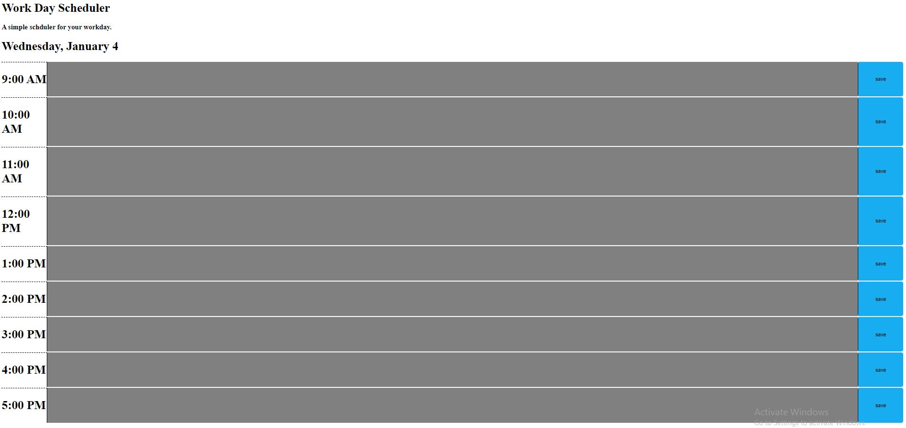

# Work Day Scheduler 1/4/2023

### Motivation
This project was created to function as an online planner to keep track of a persons task for the day. 

### Build Status
Running as a GitHub Webpage

### Features
A basic webpage with time slots for every hour of the typical work day (9am - 5pm) where a user can type in their tasks and save their progress throughout the day. The scheduler will also show which tasks are outdated or are within the current time of day. The tasks will also stay were intended even if the page is refreshed.

### Installation
N/A

### Project Preview

### How to Use
The webpage can be found on the following this link [here.](https://aguilarj5.github.io/Coding-Quiz-Challenge/)

### Credits
Coding Bootcamp

### License
N/A

